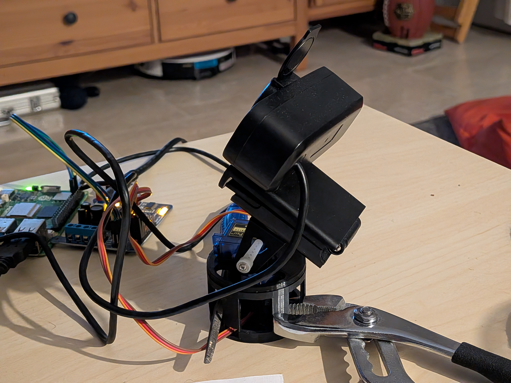
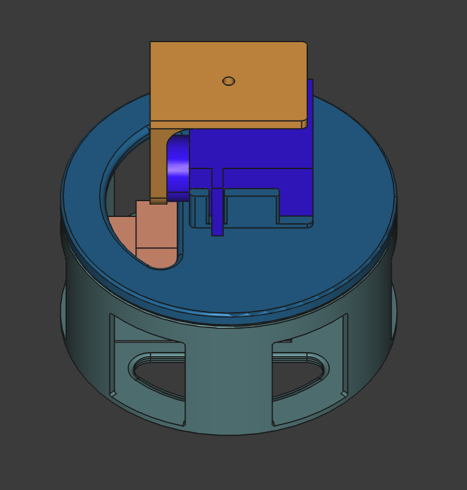
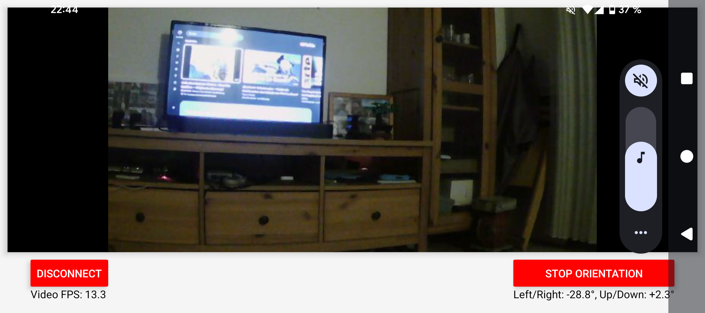

# Phone-Controlled Pan-Tilt Webcam Project

## Overview
A surveillance camera system that allows intuitive control of camera direction through smartphone orientation. Users can naturally control the camera's viewing angle by tilting and rotating their phone, creating an immersive "looking through the phone" experience.

## Hardware Architecture
- **Webcam**: Primary video capture device
- **Dual Servo Mount**: Two servos arranged in a pan-tilt configuration
  - **Horizontal Servo**: Controls yaw (left-right rotation)
  - **Vertical Servo**: Controls pitch (up-down tilt)
- **Physical Setup**: Webcam mounted on vertical servo, which is mounted on horizontal servo

## Software Components

### Mobile Application
- Captures device orientation data (yaw and roll)
- Maps phone movement to desired camera angles
- Sends control commands via HTTP POST requests
- Receives live video feed through WebSocket connection

### Backend Server (Flask)
- **Web Server**: Handles HTTP POST requests for servo angle commands
- **Video Streaming**: Streams webcam feed to mobile app via WebSockets
- **Servo Control**: Direct angle control without feedback loops

### Control Method
- **Direct Control**: Servo angles set directly based on phone orientation
- **Gradual Movement**: Takes advantage of natural phone movement patterns (unlikely to have sudden 90° jumps)
- **Real-time Response**: Immediate servo positioning based on phone tilt

## Key Features
- **Natural Interface**: Intuitive phone-based control mimicking natural head movement
- **Live Video Feed**: Real-time camera stream displayed on phone
- **Room Surveillance**: 360-degree monitoring capability
- **Responsive Control**: Direct servo control for immediate response

## Communication Protocol
- **Control Commands**: HTTP POST requests containing target servo angles
- **Video Stream**: WebSocket-based real-time video transmission
- **Data Flow**: Phone orientation → POST request → Servo positioning

## Possible Extensions
- **PID Controller**: Implementation of proportional-integral-derivative control for smoother servo motion
- **Motion Smoothing**: Enhanced trajectory planning for more fluid camera movement
- **Calibration System**: Automatic alignment between phone orientation and camera direction

## Project Goals
Create an intuitive surveillance system where users can naturally control camera direction by moving their phone, enabling comprehensive room monitoring with seamless, responsive control that feels like looking through a remote window.